<a href="../terms_of_use/" class="btn-info"> Terms of use</a>
<a href="../start_using/" class="btn-info"> Start using</a>
<a href="../self_service/" class="btn-success"> Self-service guide</a>
<a href="../openstack_flavors/" class="btn-info"> OpenStack flavors</a>



## Overview
ETAIS self-service portal is a single entry point for provisioning and managing computational and storage resources
shared by ETAIS consortium members - UT, TTU, NICPB and HITSA - as well as public cloud providers. It is aimed at
research groups affiliated with Estonian research and development institutions from both public and private sector.

> Access it at [https://minu.etais.ee](https://minu.etais.ee).

Self-service portal offers research groups a way to collaborate on using and sharing research infrastructure to
minimise bureaucracy of negotiating access, quotas and payments.

The main concepts are as follows:

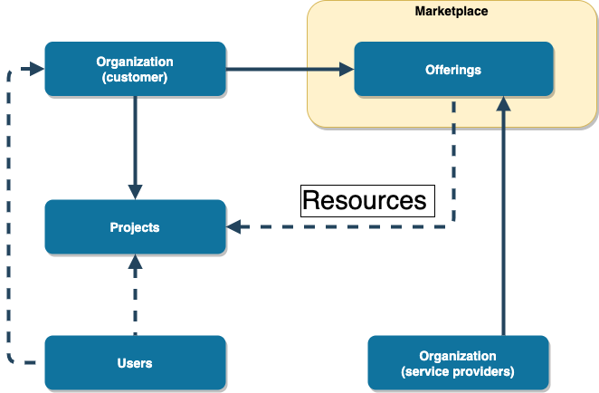

* **Organization** is a standalone entity that represents a research group or a company. Organization is responsible for the 
actions of users connected to it in different [roles](#roles).
* **Project** is an entity within an organization that aggregates and isolates teams and resources.
* **Provider** is an entity that represents account in an external service provider.
  * **Private providers** - providers that are available and manageable within a specific organization.
  * **Shared providers** - global providers that are available for all organizations. This includes HPC, cloud and storage infrastructure from ETAIS consortium.
* **Resource** - an entity within a project and a provider. Represents cloud resource. Examples: virtual machine or volume in OpenStack, quota in batch processing queue.

ETAIS self-service portal is based on [Waldur](https://waldur.com) cloud brokerage platform. The latest documentation is available from
[docs.waldur.com](http://docs.waldur.com). Below are key aspects adapted for ETAIS deployment.

## Service store

Service Store provides a common way to provision resources from both shared and private service providers.

The following resource types are offered at the moment:

* Virtual Private Cloud (VPC) - a pool of resources dedicated to a particular organization.
* Virtual Machines (requires pre-provisioned VPC) - a server with network connectivity for running customer payloads.
* Block Devices (requires pre-provisioned VPC) - persistent volumes for storage of the data.
* Batch (TBD) - access to Slurm-based processing farms.

### VPC Details
* Virtual Private Cloud (VPC) is a compute service that allows procuring and managing a pool of virtualized infrastructure
resources - like RAM, CPU, storage volumes and network resources - required to run virtual machines.
* VPC package does not limit VM count - it depends on VM flavors used and total resources available in a chosen package.
* VPC packages can be upgraded and downgraded at any moment.
* VPC packages are accounted daily based on the price of the largest resource package that was selected during the day.

## User accounts
ETAIS self-service portal supports user accounts coming from [TaaT](http://taat.edu.ee) federated identity system,
which allows to use home organisation accounts for login. Most of the larger education and research institutions in
Estonia are connected to TaaT already.

Alternatively, one can login using an account from [eduGAIN](https://www.geant.org/Services/Trust_identity_and_security/eduGAIN).

Self-Service Portal is available from: [https://minu.etais.ee](https://minu.etais.ee)

> *NB! Users need to accept Terms of Service presented on the first login for account activation!*

## Workspaces
ETAIS self-service is built around the concept of workspaces. Workspace defines structural context for the 
user. Each workspace type shows information and possible actions relevant to the user in a certain role.
There are several workspace types available in the system:

* [Organization workspace](#organization-workspace)
* [Project workspace](#project-workspace)
* [User workspace](#user-workspace)

## Roles
Users are connected to the organizations and their projects through roles. Users may have several roles, specific to
each workspace they have access to. Currently the following roles are available in the system:

* Organization owners (owners)
* Project managers (managers)
* System administrators (admins)

User roles are hierarchical in a way that organization owners can do everything that project managers and system administrators can do.

### Organization Owners
* Can access organization workspace.
* Can invite other users to participate in the organization.
* Can create and manage projects, including policies and cost limitations.
* Can manage resource providers and set their availability within projects.
* Can do everything that project managers and system administrators can do.

### Project Managers
* Can access project workspace when appointed by organization owner.
* Can manage project team from the users already connected to the organization.
* Can do everything that system administrators can do.

### System Administrators
* Can access project workspace if appointed by organization owner or project manager.
* Can provision and manage cloud resources.

## User workspace
User workspace is a personal profile management space. It allows to configure user notifications,
SSH public keys, update personal profile data etc.

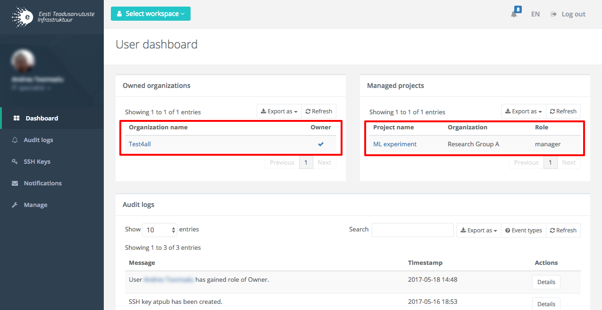

Menu entries available within user workspace:

* **Dashboard**: listing all organizations and projects where user is participating
* **Audit logs**: listing events related to user
* **SSH keys**: managing public SSH keys for the user
* **Notifications**: managing notifications for the user
* **Manage**: editing and updating user profile details

### Accessing user workspace

Access is done by clicking on user avatar and selecting one of the entries from a pop-up menu.

### Organization and project workspace selector
Navigation between different organization and project workspaces are done with the help of the workspace selector available in the header row.

### Selecting organization workspace
Open workspace selector and click on "Select" button of target organization.

### Selecting project workspace
Open workspace selector, mark target organization and click on "Select" button of target project.

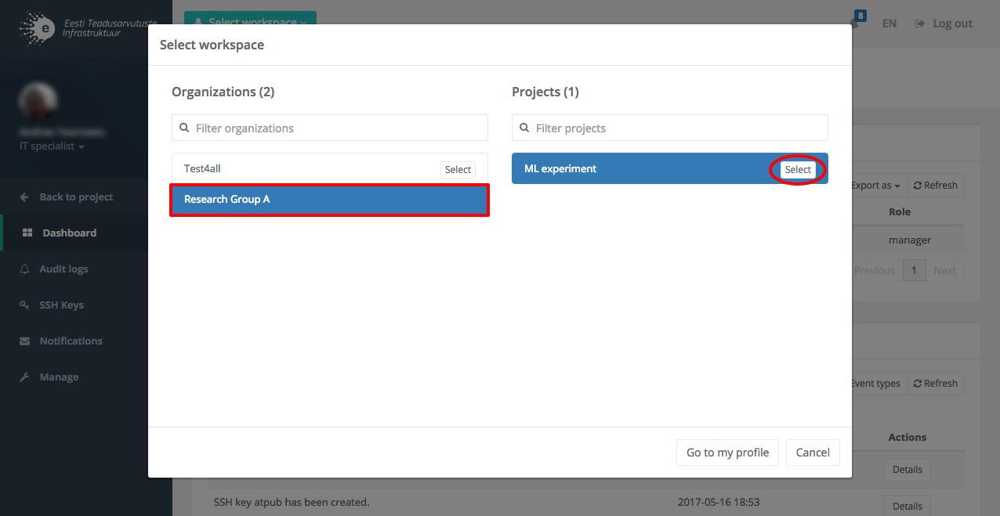

## Organization workspace
Organization workspace allows to manage projects, subscriptions to resource providers and organization members. It is also intended to provide summary, accounting and auditing information regarding organization, projects and providers. To be able to access organization workspace, you need to have a organization owner role.

Menu entries available within organization workspace:

* **Dashboard**: overview of managed resources and projects
* **Providers**: resource providers management (system and provisioned providers)
* **Projects**: projects management
* **Service store**: catalog of resources and providers, available for provisioning 
* **Analytics**: resource usage reports
* **Audit logs**: event logs related to organization, its projects and resources
* **Team**: management of organization members and their project/role accreditations
* **Accounting**: resource usage accounting information
* **Manage**: management of organization details

### Adding a project
Projects can be added by selecting "Projects" from the menu and clicking on "Add project" button. 

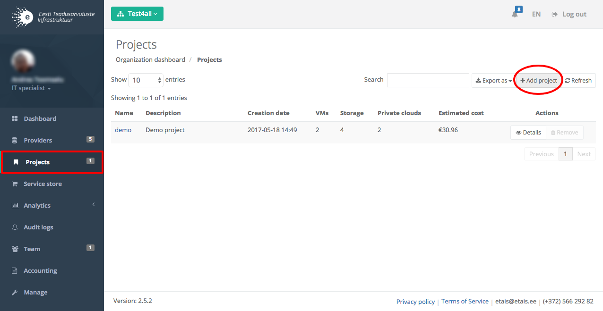

"Create project" form requires you to enter project name and optionally project description. If you need to attach security class label for the project you should select one from the list presented. Submit form by clicking on "Add project" button.

### Inviting a user
User workspace access and role management can be done on two separate levels:

* Organization workspace allows owners to invite users as organization members and to manage their project role assignments.
* Project workspace allows project managers to assign available organization members a role in their project.

Organization level invites can be created by selecting "Team" from the organization workspace menu and clicking on "Invitations" management tab.

For creating a new invitation please click on "Invite user" button.

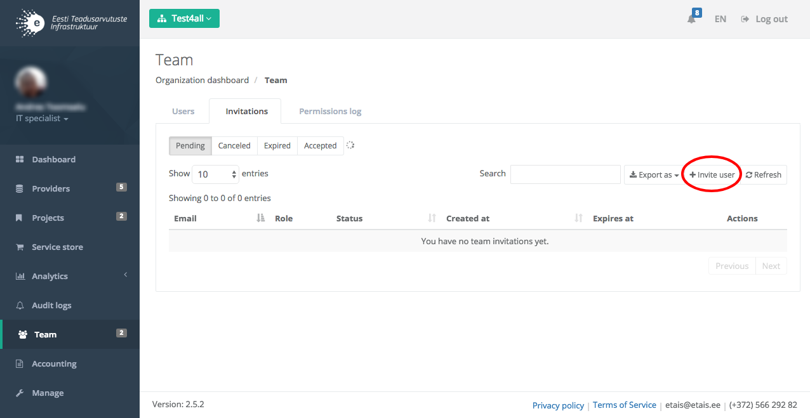

> *NB! By sending an invite to a user you also accredit this user to become an organization member! In order to complete
the joining process invited user needs to login with the URL provided in the invitation email.*  

"Invite user" form requires target user email address, initial project and role selection. Submit form by clicking on "Invite user" button.

## Project workspace
Project workspace provides tools and information required for day-to-day work and oversight over the managed IT infrastructure. Access is done via workspace selector in the top section of user interface.

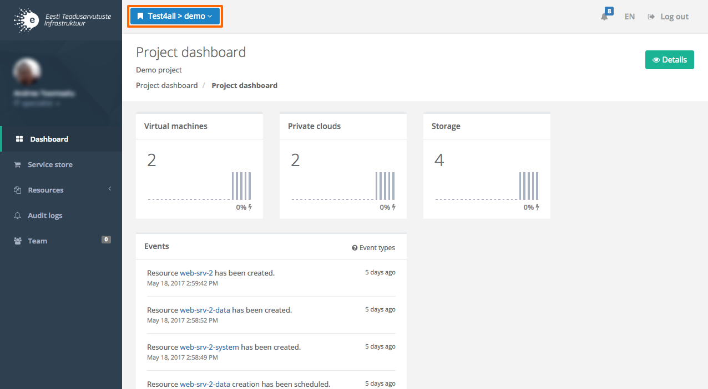

Menu entries available within project dashboard:

* **Dashboard**: overview of project resources and latest events
* **Service store**: catalog of resources and providers, available for provisioning
* **Resources**: provisioned resource listings and management views by resource category (VMs, Private Clouds, Storage, etc.)
* **Audit logs**: event logs related to project and its resources
* **Team**: project team management

## Adding a VPC
Virtual Private Cloud resource package can be added by selecting "Resources" and "Private Clouds" from the menu and clicking on "Add private cloud" button.

> *NB! There are several Virtual Private Cloud providers available from the Service Store. You need to provision at least one VPC package
from suitable provider in order to be able to create virtual machines.*

It is mandatory to input VPC Tenant name and choose initial resource package, by clicking on "VPC package: Show choices" selector.

Currently there are four VPC resource packages categories listed: trial, small, medium and large. Each category can have several resources packages mapped. For selecting a VPC resource package please mark suitable package entry and click on "Select" button, returning to the previous form.

We also strongly suggest to fill also VPC description field. Other input fields are autofilled and can be optionally customized, if required. "Checkout summary" on the right pane will provide detailed overview of VPC resouce package purchase.

> *NB! Provisioned VPC resource package will be automatically enabled for the project as a VM provider! For other projects it can be enabled by the organization owner under Provider management within organization workspace.*

## Adding a VM
> *Projects need to have at least one VPC resource package enabled, before any virtual machines can be created!*

VMs can be added by selecting "Resources: Virtual machines" from the menu and clicking on "Add virtual machine" button. 

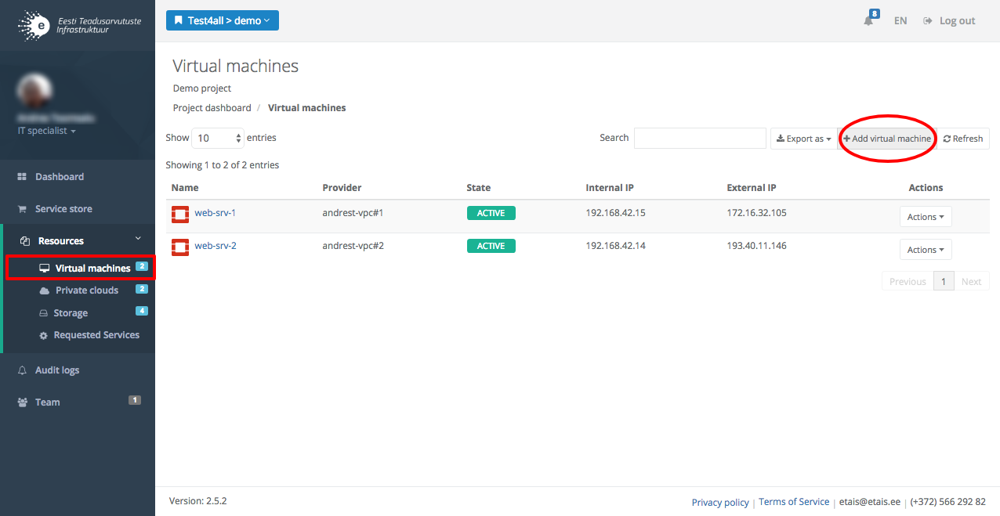

In case you have multiple VPC providers enabled within the project you will need to select also VM provider. "Create Openstack instance" form requires VM name and selection of VM image.

Please select operating system for a VM and click on "Select" button, returning to the form.

It is mandatory to select initial VM resource profile ie flavor, by clicking on "Flavor: Show choices" selector.

Flavor will set initial resource profile for a VM - how much RAM, CPU cores and storage it will have.

> *NB! VM images contain their minimum requirements information and non-matching VM flavors are disabled automatically!*

Selecting VM flavor will also update "System volume size" with the option to override it manually (to higher custom value). Data volume is always provisioned with a VM and its size can be customized and incremented in 1GB steps. 

By default provisioned virtual machines expect users to login using SSH keys. Initial SSH key for a login should be selected by clicking on "SSH public key: Show choices" selector.

> *There has to be at least one SSH public key added to user profile for it to appear in SSH key selector list!*

> *NB! Different VM images have different default user names for SSH logins! For example: CentOS images use "centos" user, Ubuntu images use "ubuntu" user, Windows images use "Administrator" user.*

By default no incoming connections will be allowed for a VM. Predefined Security Groups that contain firewall rules must be linked to a VM in order to open up access (like ssh, http, etc).

> *NB! VM create form will automatically include "default" security group which enables egress (ie outgoing) traffic for a VM and which is required in order to reply to any of the incoming packets!* 

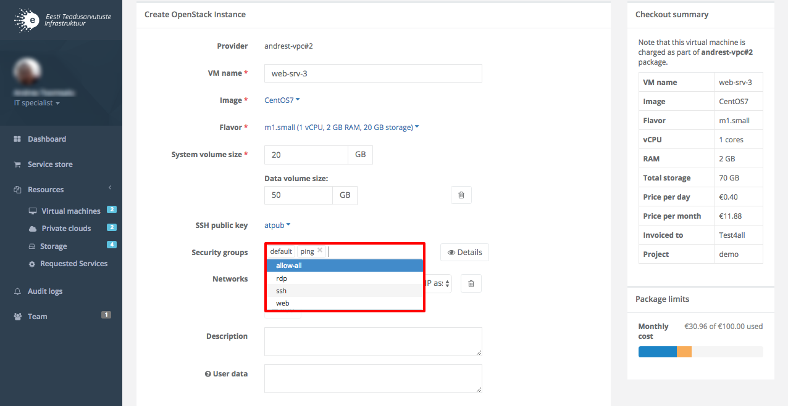

VM needs to be connected to at least one of the VPC (internal) networks and also to external network via floating IP - if extenal/public access to VM is required. 

> *Floating IP is technically realized as 1:1 NAT between VM internal ip and public network ip.*

We strongly suggest to add also VM description. In order to provision the VM please click on "Purchase" button.

> *On the right pane there will be "Checkout summary" with the purchase overview and indicative VM cost (as part of VPC package cost).*

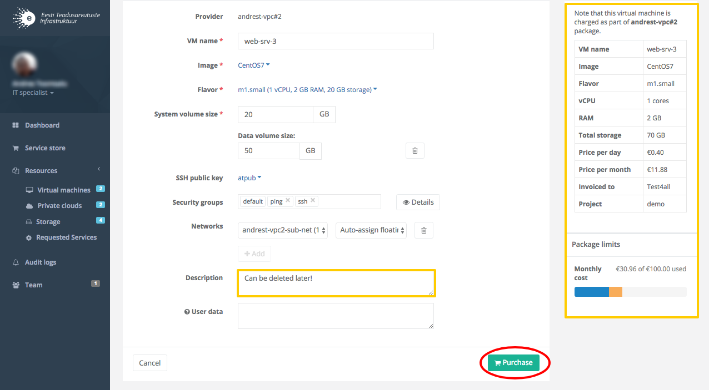

VM should reach into "Active" status when successfully provisioned. "Access" field will show IP address to access VM over SSH (Linux) or over RDP (Windows). 

> *VM access over SSH or RDP should be permitted by Security Groups linked to VM!*

> *OpenStack VPC VMs will have additional 64MB virtual hard disk attached to VM which functions as cloud-init configuation drive (not supported by self-service yet, only user-data support at the moment).*

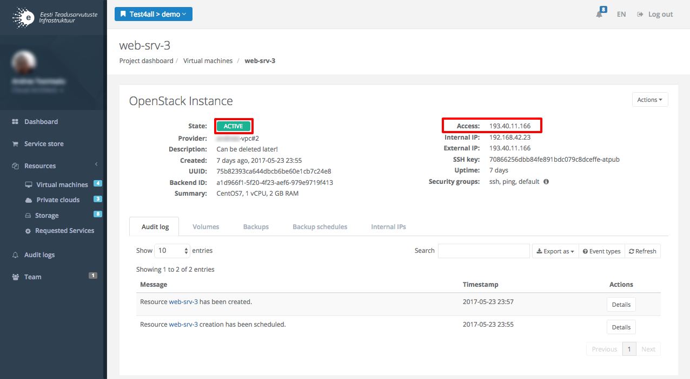

## VPC Security Groups management
Security Groups are scoped and managed under VPC package. For managing Security Groups and their rules please go into VPC detailview by clicking on provisioned VPC package name.

Existing Security Groups present within current VPC are listed under "Security groups" tab.

For adding new Security Group please click on "Create" button.

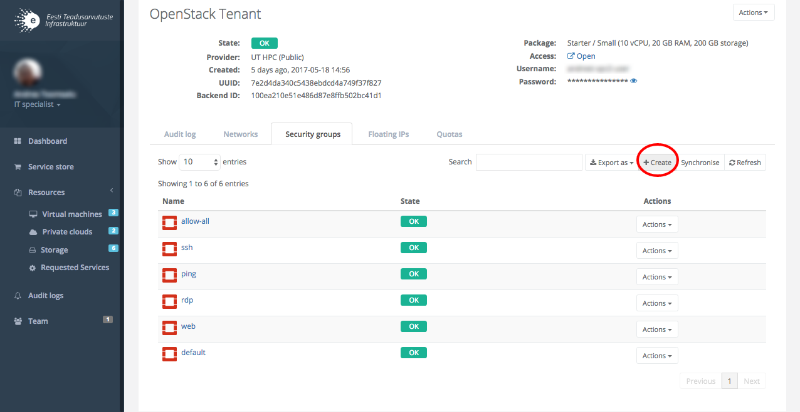

It is required to enter Security Group name and to add at least one rule. We recommend adding a description as well.

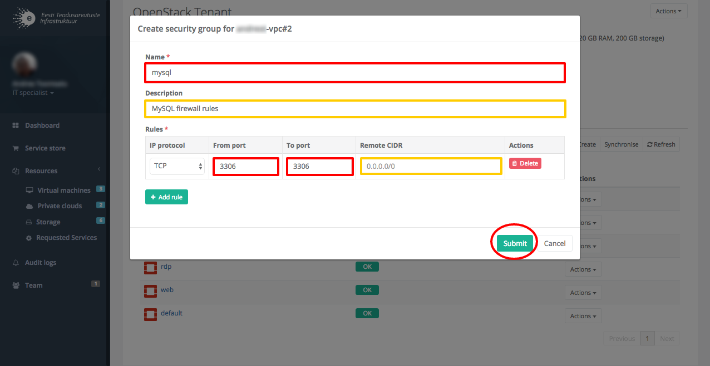

## Adding a batch queue allocation

> *In order to be able to use batch queues in ETAIS you need to setup your FreeIPA profile. You can do it in [your profile](https://minu.etais.ee/#/profile/freeipa-account/).*

Batch resource allocation in one of ETAIS HPC centers can be created by selecting "Batch processing" from Service Store
or by going to "Resources: Batch processing" and clicking on "Create" button.

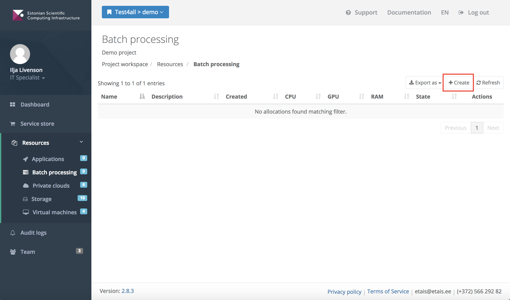

After selecting an HPC provider, you will be able to fill in the form setting the planned monthly limits
for the batch resources. Accounting for resources is usage based, summary on the right will show the maximum
cost of all limits are reached. Provision allocation by clicking on "Purchase" button.

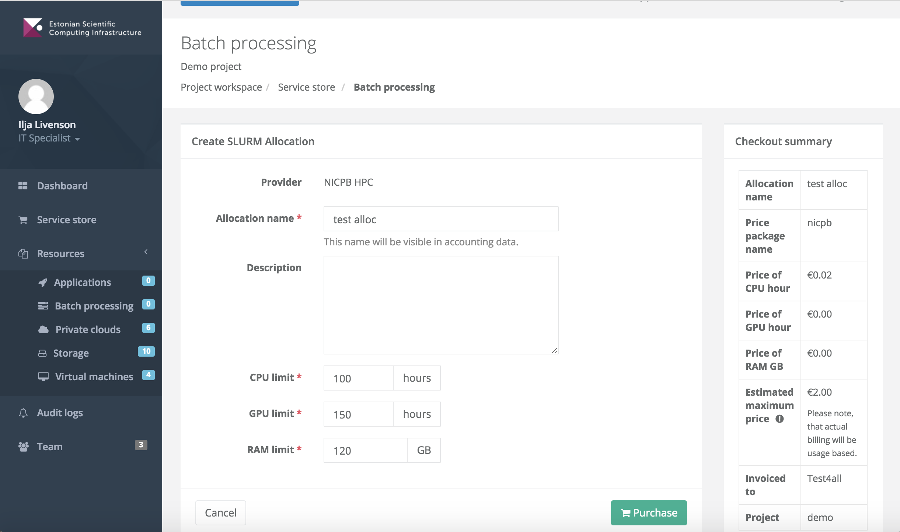

Once allocation has been created, you can see its access information:

1. Login information for SLURM head node. You will be able to use your FreeIPA account and any of the uploaded public SSH keys.
2. Account ID that needs to be passed to *sbatch* command when scheduling a job.

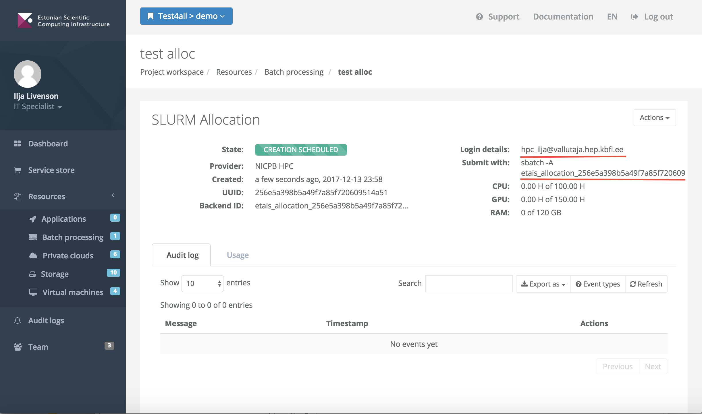
